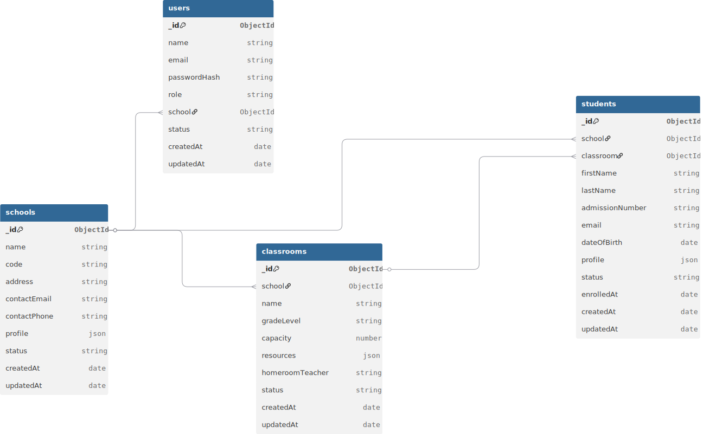

# School Management System API

RESTful backend API for managing schools, classrooms, students, and role-based users.

## Stack
- Node.js + Express
- MongoDB + Mongoose
- JWT authentication
- Role-based access control (RBAC)
- Built on the Axion manager/middleware template

## Roles
- `superadmin`
  - Full system access
  - Manages schools
  - Creates school administrators
- `school_admin`
  - Scoped to one assigned school
  - Manages classrooms and students in that school only

## Project Structure
- `managers/entities/auth/Auth.manager.js`: auth/login/admin-user lifecycle
- `managers/entities/school/School.manager.js`: school CRUD/profile
- `managers/entities/classroom/Classroom.manager.js`: classroom CRUD/capacity/resources
- `managers/entities/student/Student.manager.js`: student CRUD/enrollment/transfer
- `mws/__auth.mw.js`: JWT auth middleware
- `mws/__superadmin.mw.js`: superadmin RBAC gate
- `managers/entities/**/*.mongoModel.js`: Mongoose schemas/models
- `managers/repositories/*.repository.js`: thin repository layer (data access abstraction)
- `managers/_common/access.policy.js`: centralized RBAC + school-scope policy checks
- `managers/audit/Audit.manager.js`: audit trail persistence
- `managers/observability/Observability.manager.js`: metrics counters and latency stats

## Setup
1. Install dependencies:
```bash
npm install
```

2. Create `.env`:
```env
SERVICE_NAME=axion
ENV=development
USER_PORT=5111

MONGO_URI=mongodb://localhost:27017/axion
CACHE_REDIS=redis://127.0.0.1:6379
CORTEX_REDIS=redis://127.0.0.1:6379
OYSTER_REDIS=redis://127.0.0.1:6379

LONG_TOKEN_SECRET=replace_with_secure_value
SHORT_TOKEN_SECRET=replace_with_secure_value
REFRESH_TOKEN_SECRET=replace_with_secure_value
ACCESS_TOKEN_TTL=15m
REFRESH_TOKEN_TTL=30d
LONG_TOKEN_TTL=30d
NACL_SECRET=replace_with_secure_value

RATE_LIMIT_WINDOW_MS=60000
RATE_LIMIT_MAX=120
LOGIN_ATTEMPT_WINDOW_MS=900000
LOGIN_ATTEMPT_MAX=5
LOGIN_LOCK_MS=900000

# Comma-separated allowed origins
CORS_ORIGINS=http://localhost:3000,http://localhost:5111
```
You can start from `.env.example`.

3. Run:
```bash
node index.js
```

Base URL:
```txt
http://localhost:5111
```

## Authentication Flow
1. Bootstrap first superadmin once:
- `POST /api/v1/auth/bootstrapSuperadmin`

2. Login:
- `POST /api/v1/auth/login`
- Returns `accessToken` + `refreshToken` (and `token` alias for backward compatibility)
- Supported roles: `superadmin` and `school_admin` (active users only)

3. Authenticated requests:
- Preferred header: `Authorization: Bearer <accessToken>`
- Legacy fallback (temporary): `token: <accessToken>`

4. Refresh session:
- `POST /api/v1/auth/refreshSession`

5. Logout session (revoke refresh token):
- `POST /api/v1/auth/logout`

6. Get current profile:
- `GET /api/v1/auth/me`

## API Endpoints
Preferred endpoint surface:
- `POST /api/v1/:moduleName/:fnName`
- `GET /api/v1/:moduleName/:fnName`

Backward-compatible legacy routes are still available:
- `POST /api/:moduleName/:fnName`
- `GET /api/:moduleName/:fnName`

## OpenAPI / Swagger
- OpenAPI JSON: `GET /openapi.json`
- OpenAPI JSON (API-prefixed alias): `GET /api/openapi.json`
- Swagger UI (preferred): `GET /api/doc`
- Swagger UI (aliases): `GET /api/docs`, `GET /docs`

The OpenAPI spec includes:
- JWT bearer auth (`Authorization: Bearer <token>`)
- Legacy token header auth (`token: <token>`) for backward compatibility
- Health, auth, school, classroom, and student endpoints under `/api/v1/...`

### Auth
- `POST /api/v1/auth/bootstrapSuperadmin`
  - body: `{ "name", "email", "password" }`
- `POST /api/v1/auth/login`
  - body: `{ "email", "password" }`
- `POST /api/v1/auth/refreshSession`
  - body: `{ "refreshToken" }`
- `POST /api/v1/auth/logout`
  - body: `{ "refreshToken" }`
- `POST /api/v1/auth/createSchoolAdmin` (superadmin)
  - body: `{ "name", "email", "password", "schoolId" }`
- `GET /api/v1/auth/me` (auth)

### Schools (superadmin)
- `POST /api/v1/school/createSchool`
- `GET /api/v1/school/listSchools?limit=20&offset=0&cursor=...`
- `GET /api/v1/school/getSchoolById?schoolId=...`
- `POST /api/v1/school/updateSchool`
- `POST /api/v1/school/deleteSchool`
- `GET /api/v1/school/getSchoolProfile?schoolId=...`
- `POST /api/v1/school/updateSchoolProfile`

Example create school body:
```json
{
  "name": "Green Valley High",
  "code": "GVH",
  "address": "Main St",
  "contactEmail": "admin@gvh.edu",
  "contactPhone": "+1-555-000",
  "profile": { "principal": "Jane Doe" },
  "status": "active"
}
```

### Classrooms (superadmin + school_admin scoped)
- `POST /api/v1/classroom/createClassroom`
- `GET /api/v1/classroom/listClassrooms?schoolId=...&limit=20&offset=0&cursor=...`
- `GET /api/v1/classroom/getClassroomById?classroomId=...`
- `POST /api/v1/classroom/updateClassroom`
- `POST /api/v1/classroom/deleteClassroom`

Example create classroom body:
```json
{
  "schoolId": "<school_id>",
  "name": "Grade 6 - A",
  "gradeLevel": "Grade 6",
  "capacity": 30,
  "resources": ["projector", "smartboard"],
  "homeroomTeacher": "Mr. Smith",
  "status": "active"
}
```

### Students (superadmin + school_admin scoped)
- `POST /api/v1/student/createStudent`
- `GET /api/v1/student/listStudents?schoolId=...&classroomId=...&limit=20&offset=0&cursor=...`
- `GET /api/v1/student/getStudentById?studentId=...`
- `POST /api/v1/student/updateStudent`
- `POST /api/v1/student/deleteStudent`
- `POST /api/v1/student/transferStudent`

Example create student body:
```json
{
  "schoolId": "<school_id>",
  "classroomId": "<classroom_id>",
  "firstName": "John",
  "lastName": "Doe",
  "admissionNumber": "A-2026-001",
  "email": "john.doe@student.edu",
  "dateOfBirth": "2012-02-10",
  "profile": { "guardian": "Jane Doe" },
  "status": "active"
}
```

Example transfer body:
```json
{
  "studentId": "<student_id>",
  "targetSchoolId": "<school_id>",
  "targetClassroomId": "<classroom_id>"
}
```

## Response Format
```json
{
  "ok": true,
  "data": {},
  "errors": [],
  "message": "",
  "errorCode": "",
  "requestId": "",
  "correlationId": ""
}
```

## Error Handling
Common status codes:
- `200` success
- `201` created
- `401` unauthorized (missing/invalid token)
- `403` forbidden (RBAC/scope denied)
- `404` not found
- `405` unsupported method
- `409` conflict (duplicate/linked resource constraints)
- `422` validation errors
- `429` rate limit exceeded
- `500` internal execution failure

## Security Measures
- JWT authentication on protected endpoints
- Access token + refresh token rotation/revocation
- Login brute-force controls with temporary lockout/backoff
- RBAC middleware (`__auth`, `__superadmin`) + centralized school-scope policy
- School-scoped authorization for `school_admin`
- Helmet-based hardening (CSP/HSTS) with fallback security headers
- Restricted CORS origin allow-list
- IP-based request rate limiting
- Audit logs for sensitive RBAC actions

## Observability & Health
- `GET /health/live`: liveness probe
- `GET /health/ready`: readiness probe (includes Mongo connectivity)
- `GET /metrics`: JSON metrics snapshot (request counts, status classes, auth failures, latency)
- Structured JSON logs include `requestId`, `correlationId`, actor context, status, errorCode, and latency
- Logs are emitted for request start/completion, auth success/failure, API execution failures, and unhandled HTTP/process errors

## Database Schema Design



Notable indexes:
- `users.email` unique
- `schools.code` unique sparse
- `classrooms (school,name)` unique
- `students (school,admissionNumber)` unique
- `students.email` unique sparse

Optimistic concurrency:
- Mutable entities use Mongoose optimistic concurrency.
- For safe update semantics, pass `expectedVersion` in update payloads.

## Tests
Test runner: `Jest`

Run:
```bash
npm test
```

Coverage report:
```bash
npm run test:coverage
```
Coverage is enforced by Jest global threshold (line coverage `>= 40%`).

Current test coverage includes:
- Classroom RBAC/school scoping
- Student transfer authorization
- School deletion guard rails
- Access policy contract tests (superadmin vs school_admin)
- Pagination contract tests (limit/offset/cursor validation)
- Auth middleware contract tests (Bearer + legacy compatibility)

## Postman
Import these files into Postman:
- `postman/School-Management-System.postman_collection.json`
- `postman/Local.postman_environment.json`

Recommended run order in the collection:
1. `Auth > Bootstrap Superadmin` (run once on clean DB)
2. `Auth > Login`
3. `Schools > Create School`
4. `Auth > Create School Admin` (optional)
5. `Classrooms > Create Classroom`
6. `Students > Create Student`

The collection auto-saves `token`, `schoolId`, `classroomId`, and `studentId` from responses into variables.
Collection requests use `Authorization: Bearer {{token}}` and target `/api/v1/...`.

## Docker Quickstart
One command to run API + MongoDB + Redis locally:
```bash
docker compose up --build
```

Services:
- API: `http://localhost:5111`
- MongoDB: `mongodb://localhost:27017`
- Redis: `redis://localhost:6379`

Stop and remove containers:
```bash
docker compose down
```

Stop and remove containers plus volumes:
```bash
docker compose down -v
```

## Deployment Instructions
1. Push repository to GitHub.
2. Create MongoDB database (Atlas/local hosted).
3. Deploy Node service (Render/Railway/Fly.io/EC2).
4. Configure environment variables from `.env` list.
5. Start process with `node index.js`.
6. Verify health by calling auth bootstrap/login then protected endpoints.

## CI Pipeline Gates
GitHub Actions workflow: `.github/workflows/ci.yml`

Current gates:
- Lockfile consistency check
- Test suite with coverage report
- Docker build smoke test
- Automatic Fly.io deploy on `main` (if `FLY_API_TOKEN` secret is configured)

Required GitHub Actions secret for deploy:
- `FLY_API_TOKEN`

## Fly.io Deployment
Files:
- `fly.toml`
- `Dockerfile`

1. Create Fly app (or rename `app` in `fly.toml`):
```bash
fly launch --no-deploy
```
2. Set required secrets:
```bash
fly secrets set \
  MONGO_URI=\"<mongo_uri>\" \
  CACHE_REDIS=\"<redis_uri>\" \
  CORTEX_REDIS=\"<redis_uri>\" \
  OYSTER_REDIS=\"<redis_uri>\" \
  LONG_TOKEN_SECRET=\"<long_secret>\" \
  SHORT_TOKEN_SECRET=\"<short_secret>\" \
  REFRESH_TOKEN_SECRET=\"<refresh_secret>\" \
  NACL_SECRET=\"<nacl_secret>\" \
  CORS_ORIGINS=\"https://<your-frontend-domain>\"
```
3. Deploy:
```bash
fly deploy
```
4. Validate probes:
- `GET /health/live`
- `GET /health/ready`

## Assumptions
- `school_admin` can only manage resources inside assigned school.
- Student transfer across schools is allowed only to superadmin.
- School deletion is blocked when linked classrooms/students/admin users exist.
